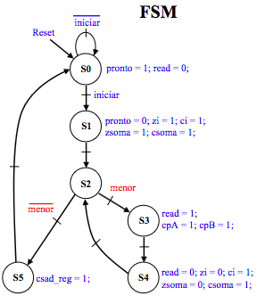
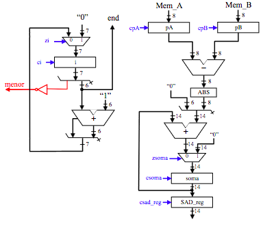
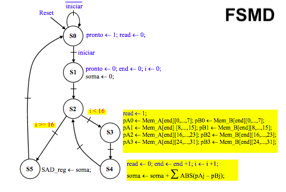
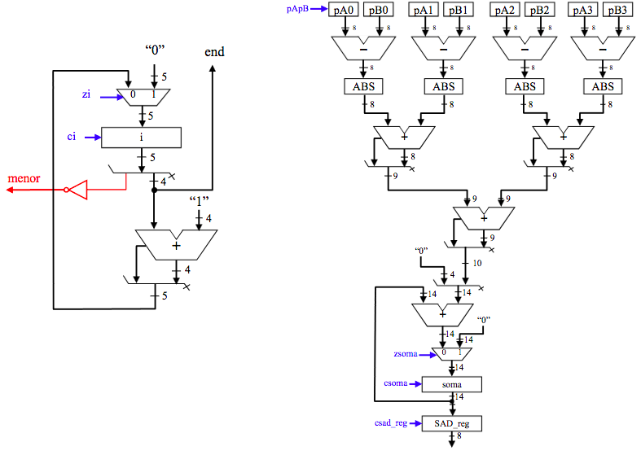

# Relatório Prático 2
**Grupo O**
Gabriel Salmoria 23100466
Gustavo Nunes Viana 23100479

##### obs:

# SAD **V1**
##### representação do bloco de controle

##### representação do bloco operativo

### Descrição:
*Somatório das diferenças absolutas, segundo a v1 do exemplo 8.*
Armazena-se a soma das diferenças, com menor custo e menor desempenho, dos dados de 8 bits lidos de duas memórias externas, por meio de iterador, end(saída do bloco operativo) MEM[end], 7 bits pois precisa ser capaz de contar até 64. Para evitar erro, o somador acumulador tem 14 bits, definido por ceil(log 64((2**8)-1)).
### Simulação:
Clock tem período de 20 ns.
Por meio do arquivo de estímulos, percebe-se que quando iniciar 1, o sistema inicia a SAD.
Como exemplo, quando a entrada mem_A 00000001 e a entrada mem_B 00000101, o resultado da subtração absoluta é igual a 00000100, e com o decorrer dos processos a soma acumulativa recebe todas as diferenças absolutas dos dados vindos das memórias externas, logo, 4(valor)x64(ciclos) = 256.

# SAD **V3**
##### representação do bloco de controle

##### representação do bloco operativo

### Descrição:
*Somatório das diferenças absolutas, segundo a v3 do exemplo 8.*
Armazena-se a soma das diferenças, com maior custo e maior desempenho, de 8 dados de 8 bits lidos de duas memórias, ou seja 32 bits de cada memória, por meio de iterador, end(saída do bloco operativo) MEM[end], 5 bits pois precisa ser capaz de contar até 16. Para evitar erro, o somador acumulador também tem 14 bits, definido por ceil(log 64((2**8)-1)).
### Simulação:
Clock tem período de 20 ns.
Primeiramente, quando o rst assíncrono é acionado em 95 ns, o sistema todo é zerado inclusive a soma acumulada.
Por meio do arquivo de estímulos, percebe-se que quando inicia`r 1, o sistema inicia a SAD.
Como exemplo, quando a entrada mem_A 00000001000000010000000100000001 e a entrada mem_B 00000101000001010000010100000101, o resultado de cada subtração absoluta é igual a 00000100, e com o decorrer dos processos a soma acumulativa recebe todas as diferenças absolutas dos dados vindos das memórias externas, logo, 16(soma de uma ciclo)x16(ciclos) = 256.
